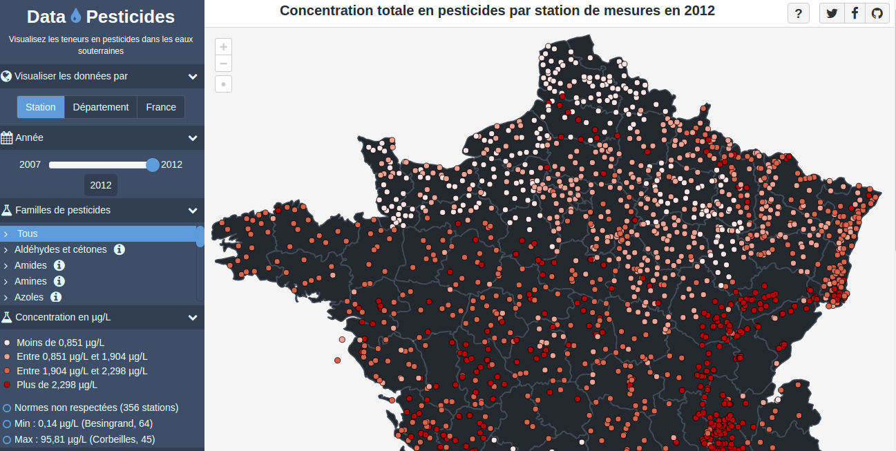

# Data-Pesticides

Data-Pesticides is a web application based on [Silex](http://silex.sensiolabs.org/) PHP microframework that provides a full-featured data-visualization about pesticides concentrations in France. The web application is available online : [https://www.data-pesticides.fr](https://www.data-pesticides.fr). It has been created in response to a [contest](http://www.developpement-durable.gouv.fr/Concours-de-data-visualisation-sur.html) launched by the [French ministry of ecology, energy and the sea](http://www.developpement-durable.gouv.fr/).

### Application requirements :

- A web server (such as Nginx or Apache)
- PHP 5.6+
- composer
- A RDF Triplestore (for instance, you can use [Blazegraph](https://github.com/blazegraph/database/releases))

### Installation :

All the data required by the application are already bundled within the package `datasets/source.tar.gz`.

- Install the latest version of Blazegraph, launch it through the command `java -server -Xmx4g -jar blazegraph.jar`, and create a new namespace named 'datapesticides' (with the mode option set to 'quads'). That's all for the database part.
- Make sure the directories var/cache/ and datasets/ are writeable
- Configure a new host into your favorite web server. See [here](http://silex.sensiolabs.org/doc/2.0/web_servers.html) for more information about setting up a Silex application into your web server.
- Set your own application parameters into the configuration file `app/config/config.php`. Basically, you will need to update the host value with your own local host you have set in your webserver for running the application.
- run the command `install.sh` in order to launch `composer install`, datasets imports and API warm up. It can take a while depending on your computer performance
- Then, go to the application homepage and enjoy !

### Import new dataset

In order to import new datasets into the triplestore, you just have to run the command `bin/console data-pesticides:load-dataset` with the following argument depending on which kind of dataset you want to load :

- `--type=stations=xxx` : pesticides|roles|departments|station_statements|station_statements_total, the type of dataset you want to import
- `--file=/path/to/dataset.csv` : The path to the dataset you want to import
- `--year=xxxx` : The year related to the dataset (only for station_statements and station_statements_total types)

You can also launch the command without any parameter in order to enter into the interactive mode. You an take a look at the `ìnstall.sh` script in order to see some examples of commands.

### Warmup the API Cache

In order to refresh all the data served by the API, you can run the following command :

`bin/console data-pesticides:warmup-api`

If you only want to refresh a particular API method, you can call it through your browser and add `?refresh` at the end of the URL, for instance `www.yourlocaldomain.com/api/data/getStations?refresh`.

### Author

[Vincent Brouté](https://twitter.com/VincentBroute).

### Licence

Copyright (C) 2017 Vincent Brouté

Data-pesticides is licensed under the MIT license (http://www.opensource.org/licenses/mit-license.php).

Permission is hereby granted, free of charge, to any person obtaining a copy of this software and associated documentation files (the "Software"), to deal in the Software without restriction, including without limitation the rights to use, copy, modify, merge, publish, distribute, sublicense, and/or sell copies of the Software, and to permit persons to whom the Software is furnished to do so, subject to the following conditions:

The above copyright notice and this permission notice shall be included in all copies or substantial portions of the Software.

THE SOFTWARE IS PROVIDED "AS IS", WITHOUT WARRANTY OF ANY KIND, EXPRESS OR IMPLIED, INCLUDING BUT NOT LIMITED TO THE WARRANTIES OF MERCHANTABILITY, FITNESS FOR A PARTICULAR PURPOSE AND NONINFRINGEMENT. IN NO EVENT SHALL THE AUTHORS OR COPYRIGHT HOLDERS BE LIABLE FOR ANY CLAIM, DAMAGES OR OTHER LIABILITY, WHETHER IN AN ACTION OF CONTRACT, TORT OR OTHERWISE, ARISING FROM, OUT OF OR IN CONNECTION WITH THE SOFTWARE OR THE USE OR OTHER DEALINGS IN THE SOFTWARE.
