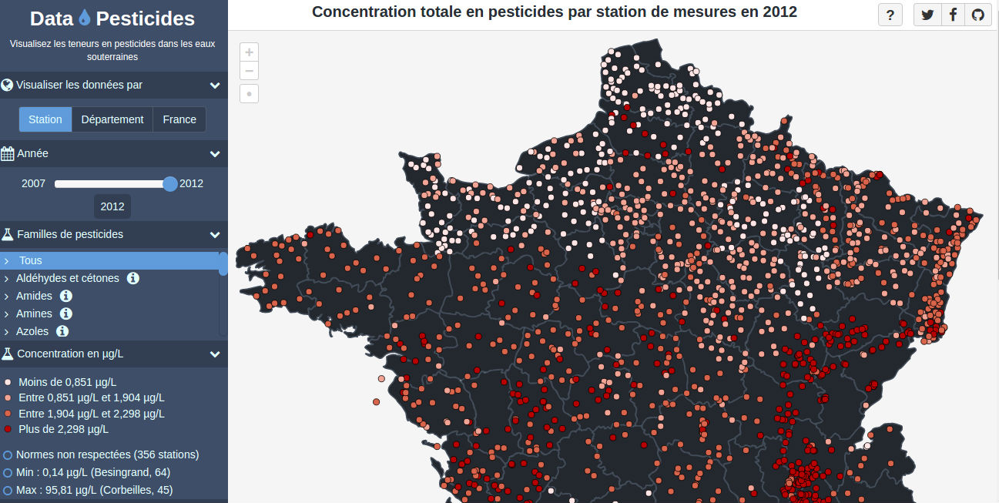

# Data-Pesticides

Data-Pesticides est une application web basée sur le microframework PHP [Silex](http://silex.sensiolabs.org/) qui propose une data-visualisation complète à propos des pesticides en eaux souterraines en France. L'application web est disponible en ligne : [https://www.data-pesticides.fr](https://www.data-pesticides.fr). Elle a été créée dans le cadre d'un [concours](http://www.developpement-durable.gouv.fr/concours-data-visualisation-sur-pesticides-dans-eaux-souterraines-0) organisé par le [Ministère de l'Environnement, de l'Énergie et de la Mer](http://www.developpement-durable.gouv.fr/).

### Pré-requis de l'application :

- Un serveur web (comme Nginx ou Apache)
- PHP 5.6+
- composer
- Un Triplestore RDF (par exemple, vous pouvez utiliser [Blazegraph](https://github.com/blazegraph/database/releases))

### Installation :

Toutes les données nécessaires à l'application sont déjà intégrées dans le projet : `datasets/source.tar.gz`.

- Installer la dernière version de Blazegraph, lancez-le via la commande `java -server -Xmx4g -jar blazegraph.jar`, et créez un nouveau namespace 'datapesticides' (avec l'option 'mode' réglée sur 'quads'). C'est tout pour la partie concernant la base de données.
- Assurez-vous que les répertoires var/cache/ et datasets/ peuvent être écrits.
- Configurez un nouveau domaine dans votre serveur web préféré. Regardez [ici](http://silex.sensiolabs.org/doc/2.0/web_servers.html) pour plus d'informations sur la façon de configurer une application Silex dans votre serveur web.
- Paramétrez votre propres réglages dans le fichier de configuration `app/config/config.php`. Normallement, vous devez seulement personnaliser la valeur du domaine avec votre propre domaine local que vous avez paramétré précédemment dans votre serveur web.
- Lancez la commande `install.sh` afin de lancer le `composer install`, les imports des jeux de données, et le pré-chauffage de l'API. Cela peut prendre du temps selon les performances de votre serveur.
- Enfin, allez sur la page d'accueil de la dataviz, c'est terminé !

### Importer un nouveau jeu de données

Afin d'importer des nouveaux jeux de données dans le triplestore, vous avez juste à lancer la commande `bin/console data-pesticides:load-dataset` avec les arguments suivants selon le type de jeu de données que vous souhaitez importer :

- `--type=stations=xxx` : pesticides|roles|departments|station_statements|station_statements_total, le type de jeu de données que vous souhaitez importer
- `--file=/path/to/dataset.csv` : Le chemin du fichier à importer
- `--year=xxxx` : L'année liée au jeu de données (seulement pour les types station_statements et station_statements_total)

Vous pouvez aussi lancer la commande avec aucun paramètre afin d'entrer dans le mode interactif (guidé). N'hésitez pas à regarder le script `ìnstall.sh` pour avoir quelques exemples de commandes d'import.

### Pré-chauffer le cache de l'API

Afin de rafraîchir toutes les données servies par l'API, vous pouvez lancer la commande suivante :

`bin/console data-pesticides:warmup-api`

Si vous voulez seulement rafraîchir une méthode d'API en particulier, vous pouvez l'appeler dans votre navigateur en y ajoutant le paramètre `?refresh` à la fin de l'url, par exemple  `www.yourlocaldomain.com/api/data/getStations?refresh`.

### Auteur

[Vincent Brouté](https://twitter.com/VincentBroute).

### Licence

Copyright (C) 2017 Vincent Brouté

Data-pesticides is licensed under the MIT license (http://www.opensource.org/licenses/mit-license.php).

Permission is hereby granted, free of charge, to any person obtaining a copy of this software and associated documentation files (the "Software"), to deal in the Software without restriction, including without limitation the rights to use, copy, modify, merge, publish, distribute, sublicense, and/or sell copies of the Software, and to permit persons to whom the Software is furnished to do so, subject to the following conditions:

The above copyright notice and this permission notice shall be included in all copies or substantial portions of the Software.

THE SOFTWARE IS PROVIDED "AS IS", WITHOUT WARRANTY OF ANY KIND, EXPRESS OR IMPLIED, INCLUDING BUT NOT LIMITED TO THE WARRANTIES OF MERCHANTABILITY, FITNESS FOR A PARTICULAR PURPOSE AND NONINFRINGEMENT. IN NO EVENT SHALL THE AUTHORS OR COPYRIGHT HOLDERS BE LIABLE FOR ANY CLAIM, DAMAGES OR OTHER LIABILITY, WHETHER IN AN ACTION OF CONTRACT, TORT OR OTHERWISE, ARISING FROM, OUT OF OR IN CONNECTION WITH THE SOFTWARE OR THE USE OR OTHER DEALINGS IN THE SOFTWARE.
